# Linux(Ubuntu)サーバの構築および運用管理の手順書

## 3年Iコース16番 富永恵

## 目次
- [環境情報](#環境情報)
- [1 Ubuntuで起動する](#1-ubuntuで起動する)
  - [Ubuntuのインストールメディア作成](#ubuntuのインストールメディア作成)
  - [Ubuntuのインストール](#ubuntuのインストール)
- [2 viエディタの操作一覧](#2-viエディタの操作一覧)
  - [カーソル移動](#カーソル移動)
  - [切り取り/コピー/貼り付け](#切り取りコピー貼り付け)
  - [文字列の検索/置換](#文字列の検索置換)
  - [入力モードへの切り替え](#入力モードへの切り替え)
  - [ファイルの保存や終了等(コマンドモード)](#ファイルの保存や終了等コマンドモード)
  - [その他](#その他)
- [3 ネットワークの基本と設定](#3-ネットワークの基本と設定)
  - [rootユーザーのパスワード設定](#rootユーザーのパスワード設定)
  - [ユーザーの新規追加(adduser)](#ユーザーの新規追加adduser)
  - [ユーザーをグループへ追加](#ユーザーをグループへ追加)
  - [Webサーバの構築](#webサーバの構築)
- [4 Apache、SSHの設定](#4-apachesshの設定)
  - [仮想ホストの作成](#仮想ホストの作成)
  - [ファイアウォールの設定](#ファイアウォールの設定)
  - [パスワード認証の設定](#パスワード認証の設定)
  - [SSHサーバー構築](#sshサーバー構築)
- [5 2段階認証の利用](#5-2段階認証の利用)
- [6 Dockerを使った環境構築や運用](#6-dockerを使った環境構築や運用)
- [URL](#url)
  - [Ubuntu Download](#ubuntu-download)
  - [Rufus Download](#rufus-download)
  - [参考](#参考)

## 環境情報
- ハードウェアモデル: ASUSTeK COMPUTER INC. VivoBook12_ASUS Laptop E203MA
- メモリ: 4.0GiB
- プロセッサー: intel🄬 Celeron(R) N4000 CPU ` 1.10GHz × 2
- ディスク情報: 62.5GB
- OS名: Ubuntu 22.04LTS
- OSの種類: 64ビット
- GNOMEのバージョン: 42.0
- ウィンドウシステム: Wayland

## 1 Ubuntuで起動する
### Ubuntuのインストールメディア作成

-  配布のUSBメモリからダウンロードしたisoファイル(https://www.ubuntulinux.jp/download/ja-remix)をrufus(rufus-4.6.exe	標準	Windows x64	1.5 MB	2024.10.21)で選択、上書き予定のusbを差し込んでそれを選択。


- ```スタート```、```OK```、以降```はい```をクリックし続ける。

図1-1 Rufus画面1

図1-2 Rufus画面2

図1-3 Rufus画面3

図1-4 Rufus画面4

- 準備完了後、```再度スタート```をクリックするとインストールが再度初めから始まってしまうためクリックしないように注意する。

### Ubuntuのインストール
- OSをインストールするPC(ASUS laptop)にusbを差し込んで起動、F2、F10キークリック等でBIOS画面を開く。
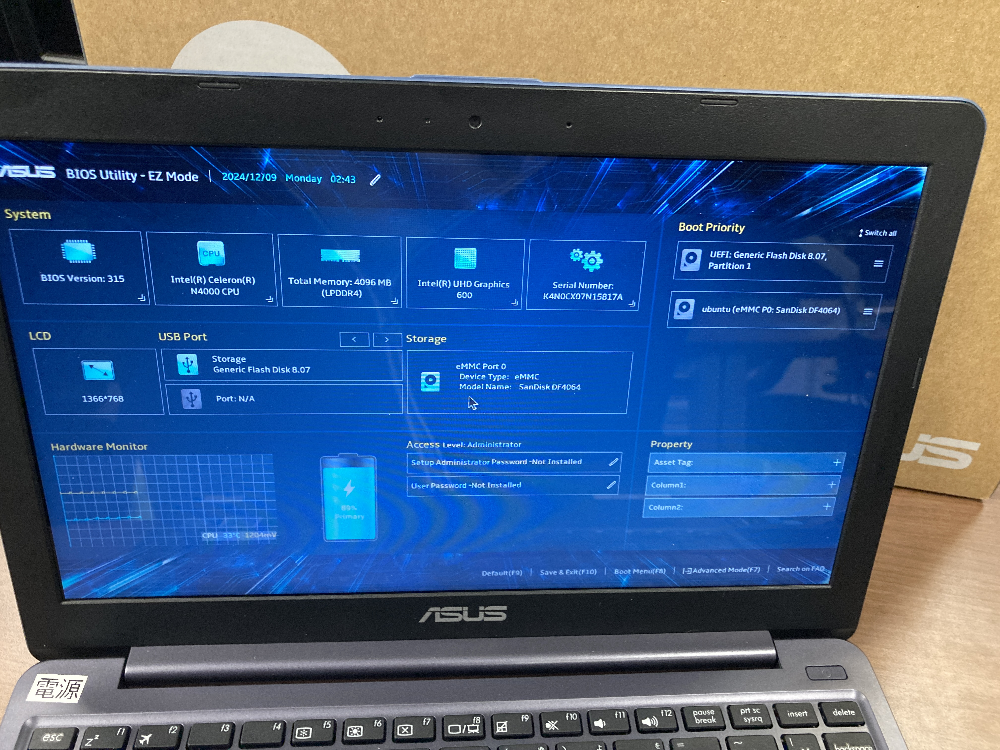
図1-5 BIOS画面

- 開かれた画面の右側のBoot Priorityの```UEFI: Generic Flash Disk 8.07```を一番上に移動させ、F10キーを押す等してOKで保存する。

- ```Try or Install Ubuntu```を選択して、ENTERキーをクリック、または放置でインストール画面に切り替わる。
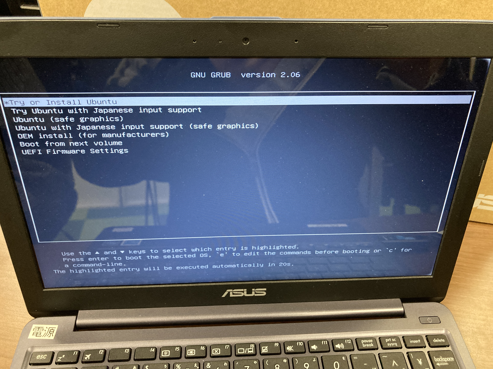
図1-6 表示された画面

- ```Ubuntuをインストール```をクリック。
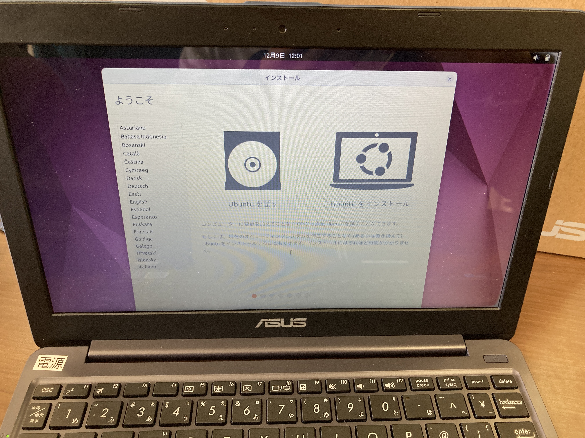
図1-7 インストール画面

- ```Japanese```、```Japanese```、を選択し、```続ける```をクリック。

図1-8 キーボードレイアウト

- ```I don't want to connect to a Wi-Fi network right now```を選択し```続ける```をクリック。
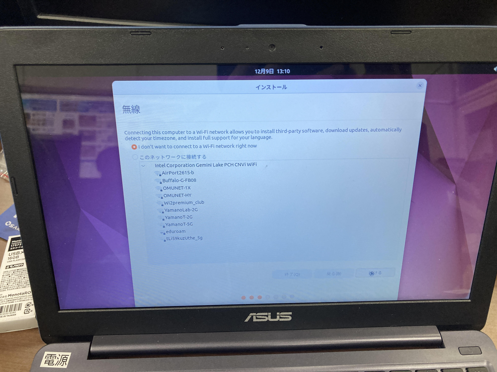
図1-9 無線

- ```通常のインストール```を選択し```続ける```をクリック。
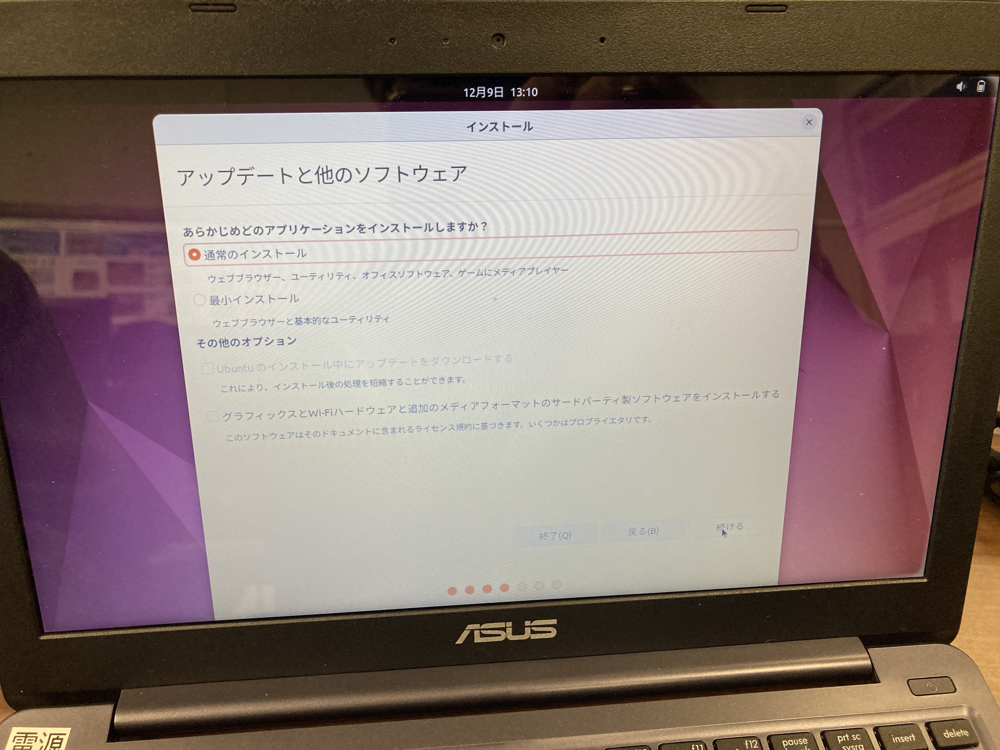
図1-10 アップデートと他のソフトウェア


- ```インストール```をクリック。(ディスクを削除してUbuntuをインストール)

図1-11 ディスクを削除してUbuntuをインストール

- ```続ける```をクリック。
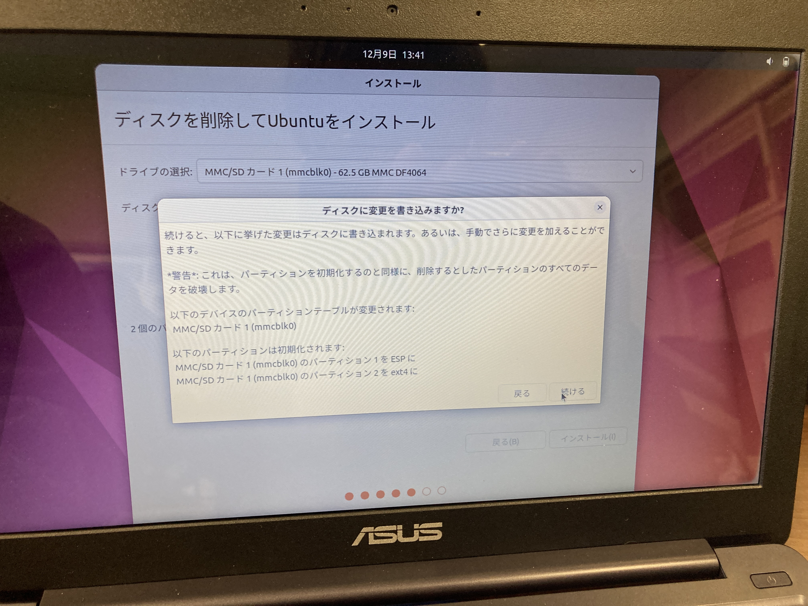
図1-12 ディスクに変更を書き込みますか?

- 住んでるところ入力して```続ける```をクリック。
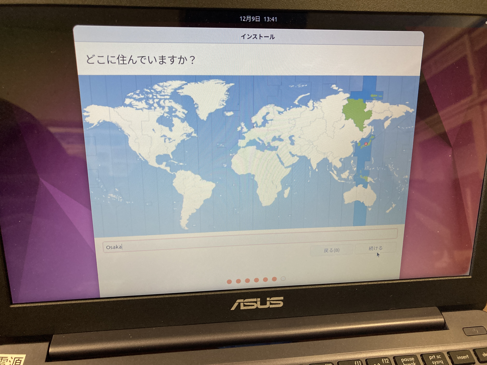
図1-13 どこに住んでいますか?

- 続けて情報を入力し、```続ける```をクリック。

- インストール完了後、```今すぐ再起動をする```をクリックする。

図1-14 インストールが完了しました

- ```Please remove the installation medium, then press ENTER```の表示が出たら、USBメモリを抜いてからENTERキーを押す。
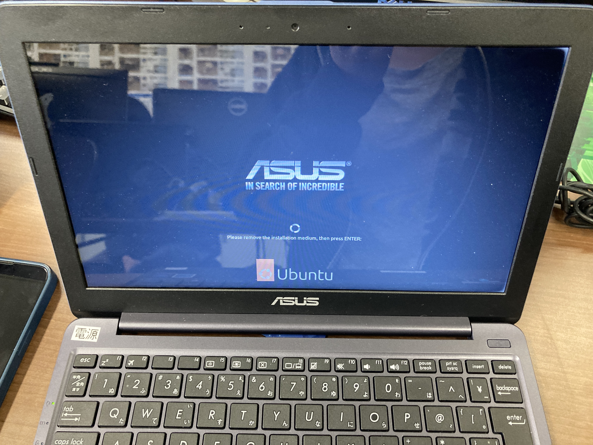
図1-15 起動画面


- Ubuntuを選択するか、放置すると画面が切り替わる。

- Livepatchの画面が出たら、```次へ```、```次へ```、```次へ```、```完了```をクリック。

図1-16 Livepatch設定


- これで、Ubuntuをインストールし、OSを起動させることができた。
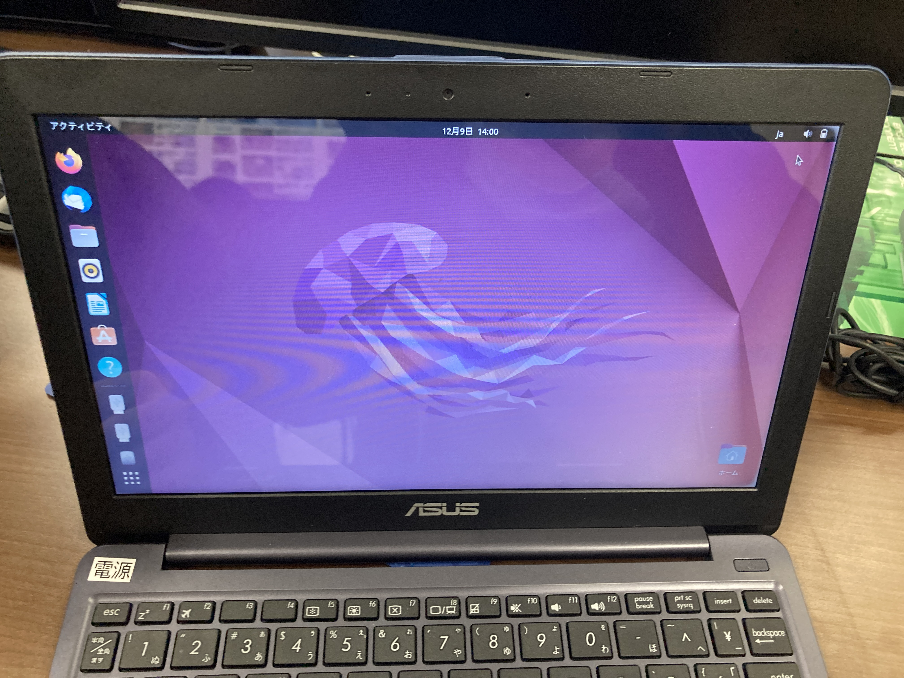
図1-17 Ubuntu起動後デスクトップ


## 2 viエディタの操作一覧
- viエディタは、Linux のシステムやサービスの設定ファイル等の変更、編集で使用される。よく使われる操作の一覧を以下に示す。

### カーソル移動
- 0(ゼロ) : 行頭に移動
- $ : 行末に移動
- gg : ファイルの先頭行に移動
- G : ファイルの最終行へ移動
- :<行番号> : 指定した番号の行に移動

### 切り取り/コピー/貼り付け
- x : カーソル位置の文字の切り取る(≒Delete キー)
- XX : カーソル位置の手前の文字の切り取り(≒Backspaceキー)
- dd : カーソルのある行の切り取り
- yy : カーソルのある行のコピー
- p : カーソルのある行の下にクリップボードの内容の張り付け
- P : カーソルのある行の上にクリップボードの内容の張り付け

### 文字列の検索/置換
- /<文字列> : カーソル位置より下を対象に検索
- ?<文字列> : カーソル位置より上を対象に検索
- :%s/<対象文字列>/<置換後文字列> : <対象文字列>を<置換後文字列>に置換
- :%s/<対象文字列>/<置換後文字列>/g : ファイル内の<対象文字列>を全て置換

### 入力モードへの切り替え
- i : カーソルの前から入力を開始
- a : カーソルの後ろから入力を開始
- I(大文字の i) : 行頭から入力を開始
- A : 行末から入力を開始
- o : カーソル行の下に空白行を挿入して入力を開始
- O : カーソル行の上に空白行を挿入して入力を開始

### ファイルの保存や終了等(コマンドモード)
- :w : ファイルの保存
- :w ファイル名 : 名前を付けてファイルの保存
- :wq(もしくは ZZ) : ファイルを保存して終了
- :q : エディタの終了
- :q! : 変更を保存せずに終了

### その他
- u : 直前の操作の取り消し(Undo)
- Ctrl+R : 直前の取り消し操作の取り消し(Redo)
- .  : 直前の操作の繰り返し
- :set nu : 行番号の表示
- :set nonu : 行番号の非表示


## 3 ネットワークの基本と設定
### rootユーザーのパスワード設定
- ```$ sudo passwd root```を実行。
- Ubuntu をインストール直後は root ユーザにはパスワードが設定されていないため、自分で設定する必要がある。

###  ユーザーの新規追加(adduser)
以下の名を例に実行する。</br>
ユーザー名 : ```megu64```</br>
パスワード : ```megu64```

- デスクトップ左下画面の9つの点のアイコンをクリックし、ターミナルを開く。
- ターミナルの操作一覧を以下に示す。
<>


- 新規に追加するユーザー名をmegu64として、```$ sudo adduser megu64``` を実行。
- パスワードとして```megu64```を入力してEnterキーを押す。
- パスワードとして```megu64```を再入力してEnterキーを押す。
- Enterキーを押し続け、場合に応じて```Y```と入力してEnter。
- ユーザーの新規追加が完了する。

### ユーザーをグループへ追加
グループ名 : ```megu64```</br>
ユーザー名 : ```megu64```

- 上記を例に、```$ sudo usermod -aG megu64 megu64``` (```$ sudo usermod -aG グループ名 ユーザ名```) を実行する。

### Webサーバの構築
- Wi-Fiに接続する。
- ```$ sudo apt update``` を実行し、パッケージを更新する。
- ```$ sudo apt -y install apache2``` を実行し、Apache HTTP Serverのインストールをする。

- ```$ sudo systemctl start apache2``` を実行し、Apacheを起動。
- ```$ sudo systemctl enable apache2``` を実行し、Apacheの自動起動の有効化。

- ```$ sudo systemctl status apache2``` を実行すると、Apacheのステータスを表示することができる。
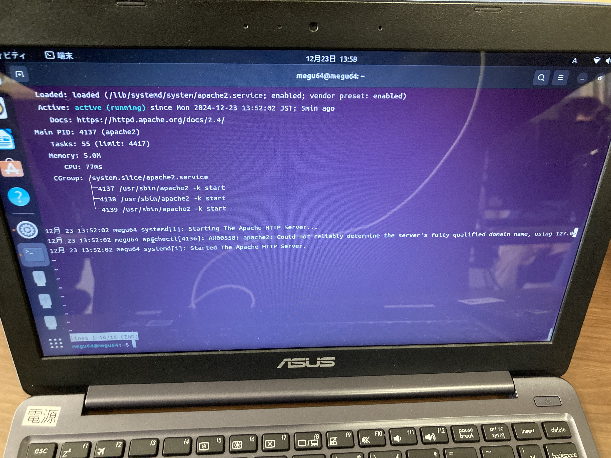
図3-1 実行結果

- Firefoxウェブ・ブラウザを開き、url=```http://localhost```を開くと、以下のような、Apacheのデフォルトページが閲覧できる。
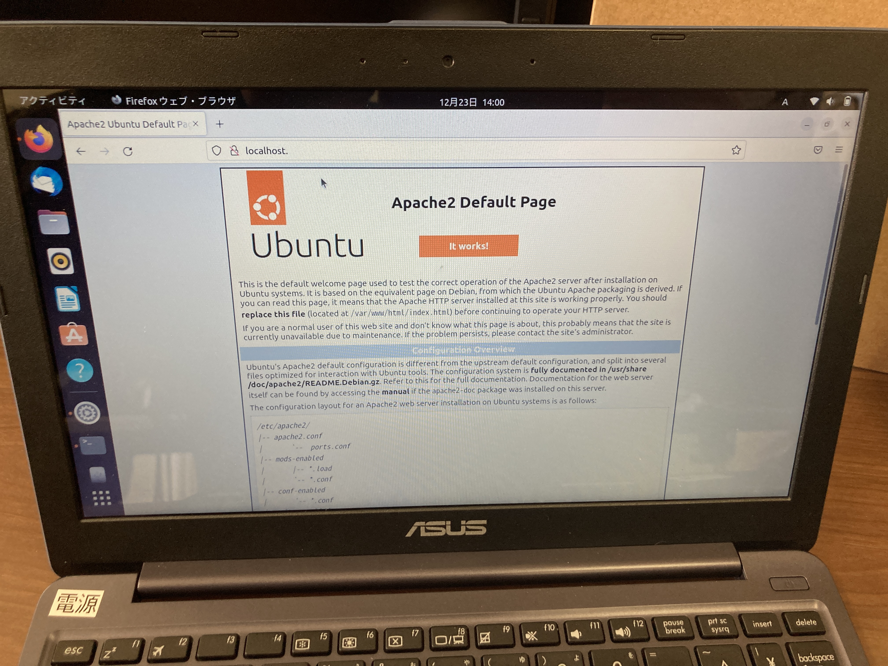
図3-2 Apacheのデフォルトページ

## 4 Apache、SSHの設定
### 仮想ホストの作成
- ```$ sudo touch /etc/apache2/sites-available/test.conf``` を実行して、デフォルトで設定されている```000-default.conf```とは異なる、```test.conf```という仮想ホストを作る。

- ```$ sudo vi /etc/apache2/sites-available/test.conf``` を実行し、Vimで ```test.conf``` を編集する。Vimの使い方は2に記した通り。

- ディレクトリファイルを```/var/www/html```、ファイル名を```test```とする設定ファイルを以下のテキストのように編集する。
<VirtualHost *:80>
    ServerAdmin webmaster@localhost
    DocumentRoot /var/www/html
    DirectoryIndex test
    ErrorLog ${APACHE_LOG_DIR}/error.log
    CustomLog ${APACHE_LOG_DIR}/access.log combined
</VirtualHost>

- 自身がコンテンツをデプロイするディレクトリのパスを```/var/www/html```として、 ```$ sudo mkdir -p /var/www/html``` (```$ sudo mkdir -p ディレクトリパス```)を実行してディレクトリを作成する。

- トップページとして表示したいファイル名を```test.html```として、```$ sudo touch /var/www/html/test.html``` (```$ sudo touch /var/www/ディレクトリ名/ファイル名```)を実行して、ファイルを作成する。


- ```$ sudo vi /var/www/html/test.html``` (```$ sudo vi /var/www/ディレクトリ名/ファイル名```)を実行して、作成したファイル```/var/www/html/test.html```にHTML形式で記述し保存する。以下に、開いたWebページに```Welcome to my page```と表示される例の記述を示す。

```
<html>
    <body>
        <h1>Welcome to my page</h1>
    </body>
</html>
```

- ```$ sudo a2ensite test.conf``` (```$ sudo a2ensite ファイル名.conf```) を実行して、作成していた仮想ホスト```test.conf```を有効化する。
- ```$ sudo a2dissite 000-default.conf```を実行して、デフォルトで設定されている仮想ホスト```000-default.conf```を無効化する。
- ```$ sudo systemctl reload apache2```を実行して、有効化した仮想ホストをサーバに反映する。


### ファイアウォールの設定
ufw コマンドを利用することで、Ubuntuでのファイアウォールの設定を行うことができる。構築したWeb サーバへのアクセスを許可するには以下のコマンドを実行する。

- ```$ sudo ufw enable```を実行して、ファイアウォールを有効化する。
- ```$ sudo ufw allow ‘Apache’```を実行し、80番ポートの開放を行う。
- ```$ sudo ufw status```を実行することでステータスの確認ができる。正常に実行できていれば、以下のような実行結果が得られる。
```
To                 Action          From
--                  ------              ----
Apache          ALLOW           Anywhere
Apache (v6)     ALLOW           Anywhere (v6)
```


### パスワード認証の設定
以下の名を例に実行する。</br>
ユーザー名 : ```megu64```

- ```$ sudo apt install apache2-utils```を実行し、apache2-utils パッケージのインストールする。

- これまでにユーザー登録を行ったことがない場合は```$ sudo htpasswd -c /etc/apache2/.htpasswd megu64``` (```$ sudo htpasswd -c /etc/apache2/.htpasswd ユーザ名```)、ユーザー登録を行ったことがある場合は```$ sudo htpasswd /etc/apache2/.htpasswd megu64``` (```$ sudo htpasswd /etc/apache2/.htpasswd ユーザ名```)を実行して、ユーザー登録を行う。(-cの記述の有無)

- ```$ sudo vi /etc/apache2/sites-available/test.conf```を実行して、設定ファイル```test.conf```を編集して以下の記述を追加する。```/var/www/html```は認証を利用するディレクトリ
<Directory ```/var/www/html```>
    AuthType Basic
    AuthName ```Restricted Content```
    AuthUserFile /etc/apache2/.htpasswd
    Require valid-user
</Directory>

- ```$ sudo systemctl reload apache2```を実行して、apache2をリロードする。


### SSHサーバー構築
- ```$ sudo apt install openssh-server```を実行してOpenSSHをインストールする。

- いこのコマンドを実行して、OpenSSHを起動する。
```
$ sudo systemctl start ssh
$ sudo systemctl enable ssh
$ sudo systemctl status ssh
```

- ```$ sudo cp /etc/ssh/sshd_config /etc/ssh/sshd_config_backup```を実行して、設定ファイルのバックアップを作成する。

- Port 任意のポート番号

- ```$ sudo vi /etc/ssh/sshd_config```を実行して、設定ファイル```/etc/ssh/sshd_config```を次のように編集する。
- 「#Port 22」と記述されている行を探し、行頭にあるコメントアウトを削除する。そして 22 番から任意のポート番号に変更する。今回は例として```2022```をポート番号に設定するため、```Port 2022```のように編集する。

- ```$ sudo ufw allow 2022/tcp``` (```$ sudo ufw allow 任意のポート番号/tcp```)を実行して、外部からrootユーザーでログインできないように設定する。

- クライアントPCのターミナルやPowerShellで```$ ssh ユーザ名@ホスト名(もしくは IP アドレス) -p ポート番号```を実行してパスワードを入力すると、SSH接続でログインすることができる。


- ```$ sudo systemctl reload sshd```を実行して、sshdのリロードをする。

## 5 2段階認証の利用
- SSHを利用するクライアントPCで鍵生成を行う。コマンドプロンプト、PowerShell、ターミナル、端末等から実行する。

- ```$ ssh-keygen -t ed25519 -f ./.ssh/id_ed25519``` (```$ ssh-keygen -t 暗号化アルゴリズム -f ファイル名```)を実行して、認証鍵を生成する。暗号化アルゴリズムは現在主流の```ed25519```の使用を勧める。


- ```$ cat $HOME\.ssh\id_ed25519.pub | ssh megu64@10.133.3.68 -p 2022 "mkdir -p ~/.ssh && chmod 700 ~/.ssh && cat >> ~/.ssh/authorized_keys && chmod 600 ~/.ssh/authorized_keys"```</br>(```$ cat $HOME\.ssh\公開鍵のファイル名 | ssh ユーザ名@ホスト名(もしくは IP アドレス) -p ポート番号 "mkdir -p ~/.ssh && chmod 700 ~/.ssh && cat >> ~/.ssh/authorized_keys && chmod 600 ~/.ssh/authorized_keys"```)を実行して、公開鍵をサーバーに登録する。この操作で作成するディレクトリやファイルは所有者以外が操作できないように権限の変更をしておくとよい。

- サーバーPC(Ubuntu)で```$ sudo vi /etc/ssh/sshd_config```を実行して、```/etc/ssh/sshd_config```に```AuthenticationMethods publickey,password```を追加して保存する。
- ```$ sudo systemctl reload ssh```を実行してSSHをリロードする。

- 設定完了後、接続テストを行う。秘密鍵を削除した状態で SSH 接続が拒否されれば、公開鍵認証が正常に動作している。次に、秘密鍵を戻して接続し、パスワード入力が求められれば、2 段階認証が機能していることが確認できる。

## 6 Dockerを使った環境構築や運用

- 以下のコマンド全てが入力されたdownload_install.shをロード、もしくは一行ずつ実行する。
```
$ sudo apt-get update
$ sudo apt-get install ca-certificates curl
$ sudo install -m 0755 -d /etc/apt/keyrings
$ sudo curl -fsSL https://download.docker.com/linux/ubuntu/gpg -o /etc/apt/keyrings/docker.asc
$ sudo chmod a+r /etc/apt/keyrings/docker.asc:

$ echo "deb [arch=$(dpkg --print-architecture) signed-by=/etc/apt/keyrings/docker.asc] https://download.docker.com/linux/ubuntu$(. /etc/os-release && echo "$VERSION_CODENAME") stable" | sudo tee /etc/apt/sources.list.d/docker.list > /dev/null
$ sudo apt-get update
$ sudo apt-get install docker-ce docker-ce-cli containerd.io docker-buildx-plugin docker-compose-plugin
```

- 以下の操作でDockerのインストール状況、バージョン等を確認することができる。
```
$ sudo docker --version
$ sudo systemctl status docker
```

- 以下の操作でdockerグループにユーザーを追加しておくことで、dockerコマンドをユーザーで実行することができるようになる。
```
$ sudo usermod -aG docker $USER
$ newgrp docker
```

- 基本的にコンテナを起動するためには```$ docker container run [OPTIONS] IMAGE [COMMAND] [ARG...]```の書式に合わせ、利用用途によって内容が変わる。IMAGEの部分に関しては、```https://hub.docker.com/```で公開されているものを参考にするとよい。

## URL
### Ubuntu Download
- https://www.ubuntulinux.jp/download/ja-remix
### Rufus Download
- https://rufus.ie/ja/

### 参考
WindowsでUbuntuのインストールUSBメディアを作成する
- https://diagnose-fix.com/topic2-003/

改めてUbuntuに入門したい人向けのUbuntuサーバー講座2024
- https://gihyo.jp/admin/serial/01/ubuntu-recipe/0820

viエディタってなんだろう
- https://qiita.com/Shioshio4037/items/35ebc70e4509c6fb366a

Apache Webサーバーを作ってみよう！
- https://eng-entrance.com/apache-web%E3%82%B5%E3%83%BC%E3%83%90%E3%83%BC%E3%82%92%E4%BD%9C%E3%81%A3%E3%81%A6%E3%81%BF%E3%82%88%E3%81%86%EF%BC%81

UbuntuでのApacheインストール方法完全ガイド｜初心者向け設定とトラブルシューティング
- https://www.linux.digibeatrix.com/archives/418

【入門】VPSで借りたubuntuをサクッとセキュリティ向上
- https://qiita.com/otohusan/items/e65cd6405fceac7702ee


Docker's curated GenAI catalog
- https://hub.docker.com/

